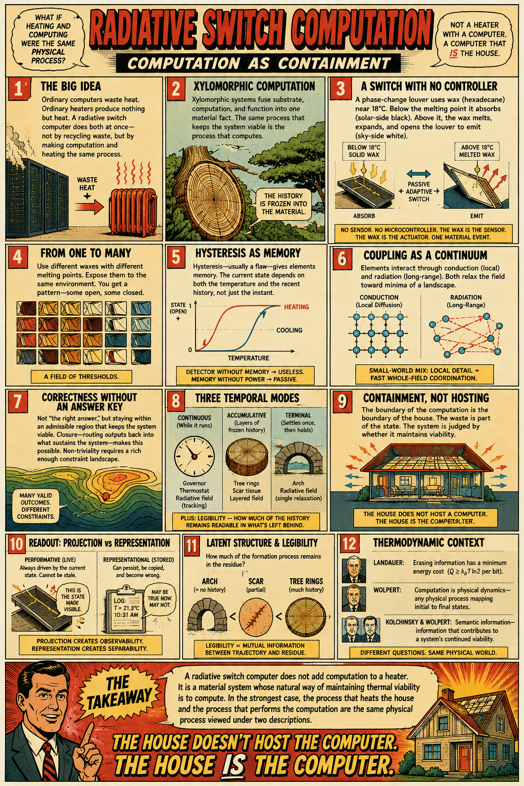

# Computation as Containment

[Radiative Switch Computation](https://standardgalactic.github.io/computation/radiative-switch/radiative_switch_computation.pdf)

[Notes](https://standardgalactic.github.io/computation/radiative-switch/Radiative_Switch_Computation-notes.pdf)

[Buildings that Think with Wax and Heat](https://standardgalactic.github.io/computation/radiative-switch/) — *Audio Overview*

